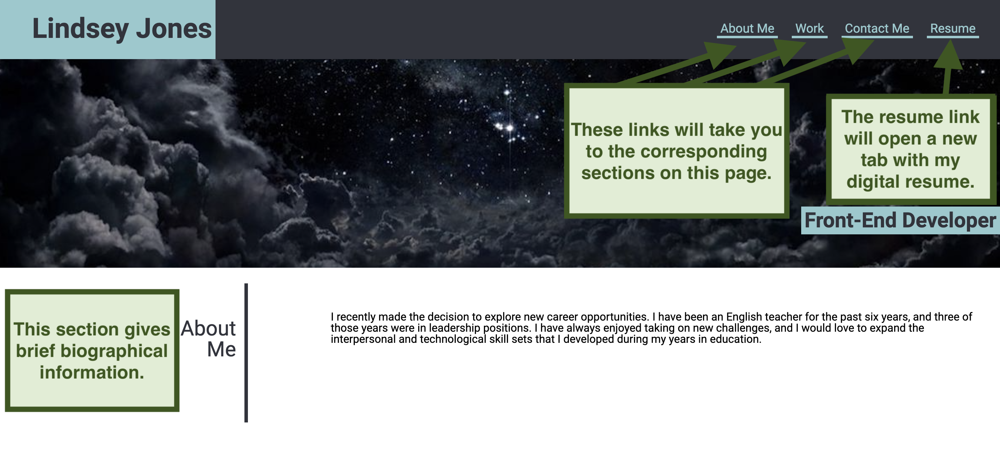
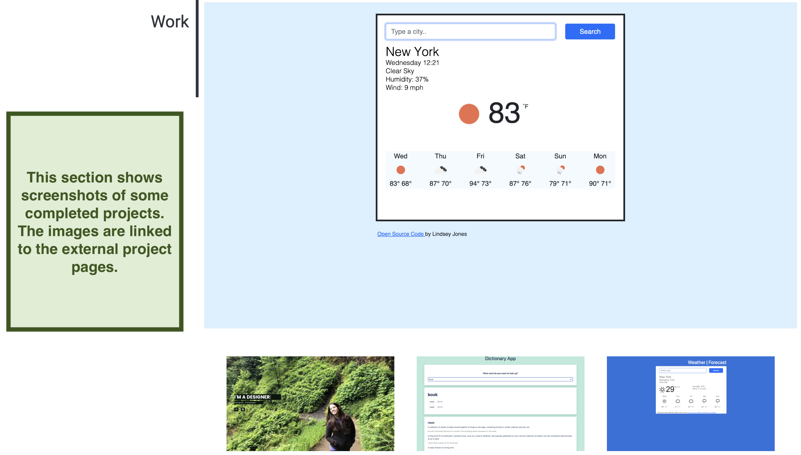
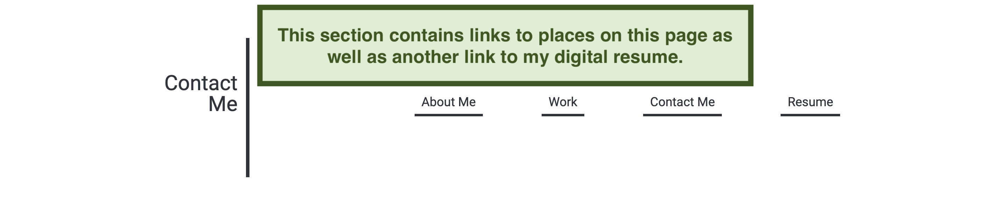

# challengeTwoUT

<a href="https://l-jones-hub.github.io/challengeTwoUT/" title="" target="_blank">Deployed Site</a>

## Description

This project's purpose is to be a starting point for an online portfolio to use during job hunting. Similar pages are recommended if not required on many job applications to show completed projects to potential employers.

## Usage

Click on the links in the navigation bar at the top-right of the screen to navigate to each section and learn more about Lindsey Jones.

